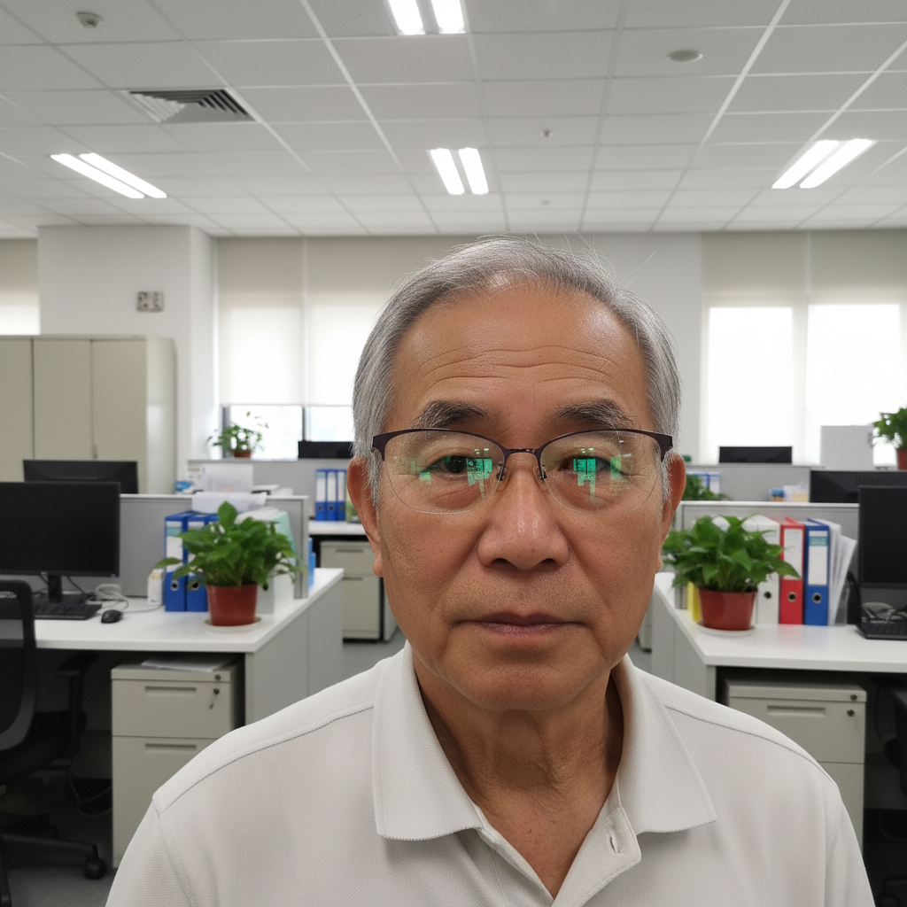
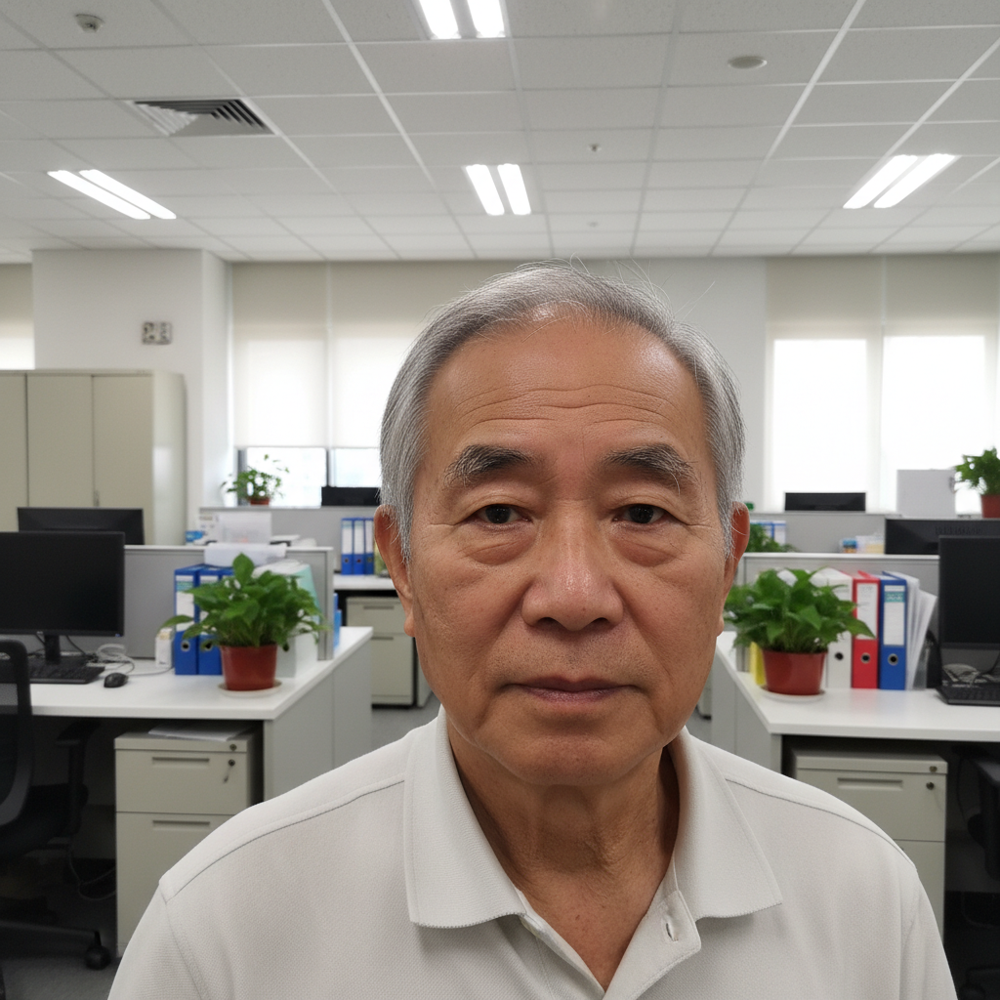
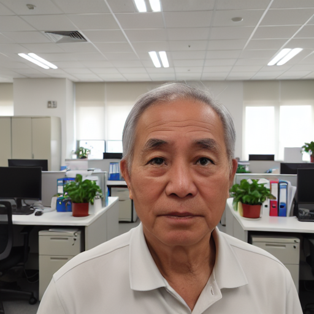

# Glasses Removal — Fine-tuned Image-to-Image Model
## Imperial Gen AI Module Coursework

This repo documents the training pipeline for fine-tuning of an image-to-image diffusion model on the task of **glasses removal** from portrait photos.

## Repository Structure

- **Dataset & Evaluation Notebook** — covers dataset generation and model evaluation
- **Fine-tuning Notebook** — the full fine-tuning pipeline
- **`generation_examples/`** — sample outputs comparing the base and fine-tuned models

## Generation Examples

| Input (with glasses) | Ground Truth (no glasses) |
|:---:|:---:|
|  |  |
| **Base Model Output** | **Fine-tuned Model Output** |
|  |  |
